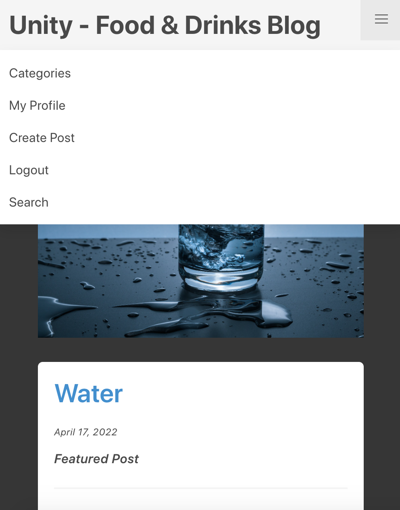

# Unity - Food & Drinks

## Full Stack Frameworks with Django - Milestone Project 4

[Unity - Food & Drinks](https://unity-food-blog.herokuapp.com/) is an online recipe blog, where people can post and find new recipes for different kind of food and drinks. The thought behind this blog was to unite different recipes from all over the world, therefore the name “Unity”. 

## Description
Based on a thorough research on several blog websites with the focus on food and drinks, I found my purpose behind the Unity - Food & Drinks Blog. I found many websites to be very cluttered with information, ads and things that would set aside the viewers eyes from the actual purpose, which is to find a recipe for meals and/or drinks. Like my previous projects, I’ve followed this simplistic idea to put either the product or purpose right in the center with as little distractions as possible. “Unity - Food & Drinks” induces a simplistic idea of a blog in order to underline the basic 'CRUD' operations on databases. 
The site's architecture is very straight forward and minimalistic. The purpose is to allow the user to focus more on the recipes themselves and not to be baffled with many unnecessary pop-ups or unwanted browsing. 

## UX
### Why This Project
The main goal with this project was to create a Full Stack web application to demonstrate the knowledge and skillset obtained throughout the course. 
A passing grade in this project is required to graduate the course and obtain the Certification Degree. 
The site is using Python and Django Framework with a back-end database (PostgreSQL) for the back-end stack.
HTML5, CSS3 with Bootstrap 4.5 as framework and python packages such as Ckeditor was used for the front-end.

I realised one day that one of my questions, or if you may call it “struggles” in my daily life was “What should I eat today?”. That inspired my first user story and it all started from there. I wanted to create a website where you will find no limits to what food you will be cooking today. With inspiration from all over the world, this blog could inspire new ideas and hopefully create a bigger interest with cooking food. The user is able to find recipes from other users, which makes it more personal. 

#### Audience
- Everyone who is interested in either food or drinks
- All ages, both men and women.
- Users looking for inspiration for cooking recipes

## User Stories

| AS A     | I WANT TO BE ABLE TO ... | SO THAT I CAN... |
| ----------- | ----------- | ----------- |
| Site User | access the website with any devices | use the website anytime and anywhere |
| Site User | access all the important services from the nav bar| navigate through the blog with ease |
| Site User | click on a post  | read the full text |
| Site User | register an account | comment and add my own posts |
| Site User/Admin | view comments on an individual post | read the conversation |
| Site User | add comments to the blog posts | be involved in the conversation |
| Site User/Admin | create, read, update and delete posts | manage my blog content |

### Color Scheme
Color scheme is important as this is one of the first things site visitors notice when visiting the site. I chose white & blue to be the site's primary colors because these colors are easy and provide a positive feeling. The navigation bar remains a very bright gray color. Overall, the design keeps a very classic and simplistic look.

## Features

### Accounts

The accounts app will allow users to register for free and create their own unique account. The user is able to customise a profile with a short description and a profile picture. This is built using Django's authentication and authorization to validate profile data.

The users will register using the registration form, found it the navbar. Registered users will be able to login by using the login form with their username and password.

### Homepage

Displays the Featured Post, and the latest posts in the blog

On this page, a user can filter the posts by two categories, either Food or Drinks.

### Navbar
##### While logged out
Navbar is fixed at the top of pages across the site, so that the site visitors easily navigate the whole site.  Navbar contains  `Logo`, `Categories`, `Signup`, `Login` and `Search`

##### While logged in

When logged in, the `Signup` &  `Login` are replaced by  `Create Post` & `Logout`

The navbar is reduced to a hamburger menu on smaller screen sizes

### Post Page & Comments
The blog post page includes a section for the entire post, where you will access the bigger scaled picture and you can read through the post which you have chosen.

The user can find the comment section to the right, where the user can read and be involved in the conversation.

As a user, you can save your posts as draft and you can also edit your post after they have been published.

### Search box

The search box is a function where you are able to find certain blog posts of your own choice.

## Testing
### Code Validation
- [W3C HTML Validator tool](https://validator.w3.org/#validate_by_input) was used to validate my HTML code.
- [W3C CSS Validator tool](https://jigsaw.w3.org/css-validator/#validate_by_input) was used to validate my CSS code.
- The W3C Validator tool doesn't recognise the Bulma CSS templating or the cloudinary links, which has resulted in a few errors in relation to the CSS and HTML code. However, all other code is validating fine.
- [Pep8 Online tool](http://pep8online.com/) was used to validate my Python syntax.
### Bugs

I was having a problem while deploying my project to Heroku. I was getting the error: “Error: Could not build wheels for backports.zoneinfo, which is  required to install pyproject.toml-based projects.
Push rejected, failed to compile with Python app.”
I found the solution on stack overflow and the issue turned out to be coming from Heroku. The problem was that when I’m replying the project to Heroku, it uses python version 3.10.x as a default and backports.zoneinfo is not working properly with this version. I was suggested to switch to version 3.8.x(stable) which apparently should be more stable. 
I did this by creating a runtime.txt file in the root directory and adding the content “python-3.8.10”. 

After deploying my project to Heroku, I experienced a number of bugs. At first, I had some trouble accessing the create post models where I would get an issue with the csrf tokens.

Here is a screenshot of the error:

The issue was fixed by adding this code to the setting.py file:

Another issue that I encountered was that Heroku wasn't loading the css files properly and all the images were showing original sizes.

Heroku was not loading the static files properly that were uploaded to Cloudinary. After some tutoring, we resolved this issue by adding and refactoring some code in the settings.py file.
There were 3 issues that I found:

- This command on line 18 was under-indented - An indent should be a tab, or 4 spaces, it was only 3 spaces

- The same issue was on line 115 - only 3 spaces, rather than a tab (4 spaces)

- And finally, I added the CLOUDINARY_STORAGE env var and linked it to the CLOUDINARY_URL

CKeditor was being used for the text box feature. It was working fine locally but after being deployed to Heroku, it stopped showing.

I was able to resolve this by adding the ckeditor script to the base.html template.

The last notable error was with my database key. I'm not sure how this happened but the database key for the postgres was not matching the one in Config Vars on Heroku. This was resolved by just copying the key from the config vars to my project again.

### Responsiveness

Chrome DevTools and physical devices were used throughout development for a number of purposes, one of which was to test the responsiveness and rendering across a range of sizes and devices. As issues were found they were either fixed at the time or noted and returned to later.

The site has been tested successfully on

Apple Macbook Pro - Safari browser, Google Chrome and Mozilla Firefox

Apple iPhone 6,7 &8S - Safari Browser

Desktop - Chrome v.74

Desktop - Firefox v.67

## Technologies Used

  * [Visual Studio Code](https://code.visualstudio.com/) - The IDE used for developing this project.
  * [GitHub](https://github.com/) - Used to store and share all project code remotely.
  * [GitPod] - Used to finalise the project and refine the code and minor errors

**Front-End Technologies**
  * [HTML5](https://developer.mozilla.org/en-US/docs/Web/Guide/HTML/HTML5) - Used as the base for markup text.
  * [CSS3](https://developer.mozilla.org/en-US/docs/Archive/CSS3) -  Used to add styles to the HTML.
  * [Font Awesome](https://www.bootstrapcdn.com/fontawesome/) - Used for icons in the website.
  * [Bootstrap4](https://www.bootstrapcdn.com/) - Used to align the elements in the website using the grid system. And also used to create the hamburger button, the models, the buttons to style the forms.
  * [CKeditor](https://ckeditor.com/) - Used to add a rich text editor to stylize the blog posts.
  * [Cloudinary](https://cloudinary.com/) - Used to store the CSS files and images used in the blog.
  * [Widget_tweaks] - This tool was used to customize the form fields in the templates
  * [Bulma-CSS-library](https://bulma.io/) - I used the Bulma CSS-library to easily style my website.

    **Back-End Technologies**

  * [Python 3.8.10](https://www.python.org/) - Used as the back-end programming language.
  * [Django](https://docs.djangoproject.com/) -  Used as my Python web framework.
  * [Heroku](https://www.heroku.com/) - for deployment
  * [PostgreSQL](https://www.postgresql.org/) - Used as relational SQL database plugin via Heroku.

  ## Deployment
I used GitHub for my version control and Heroku to host the live version of my project.
The 'Unity - Food & Drinks Blog' project was developed using the [GitPod](https://www.gitpod.io/) online IDE and
using Git & GitHub for version control. It is hosted on the [Heroku](https://heroku.com/) platform, with static files and user-uploaded images being hosted in Cloudinary.
Heroku had been experiencing a security breach at the time of deployment, so the option to connect the app to a Github repository was down. To go around this issue, I had to use the Heroku cli in Gitpod which I hadn't done before.

To deploy my website to Heroku, 
I used the following steps:

1. Created the app using a unique name in Heroku.

2. Went to the **Resources** tab in Heroku and searched for **Heroku Postgres** in the 'Add-Ons' section.

3. Selected the free **Hobby** level.

4. Updated the `env.py` file within my local workspace with the `DATABASE_URL` details, and the `settings.py` to connect to the database using the `dj_database_url` package.

5. Ran the `python manage.py makemigrations`, `python manage.py migrate`, `python manage.py createsuperuser` commands to migrate the models into Heroku Postgres and create a new super user in the new PostgreSQL database.

6. Went to the **Settings** tab in Heroku and clicked on the **Reveal Config Vars** button.

7. Copied and pasted all of the `env.py` default variables into Heroku's Config Vars settings.

KEY | VALUE
--- | -----
DATABASE_URL | link to db |
CLOUDINARY_URL | cloudinary secret key |
SECRET_KEY | site secret key |

8. Install the Heroku cli with the command: curl https://cli-assets.heroku.com/install.sh | sh

9. Login to heroku and enter your details.
- command: heroku login -i

10. Get your app name from heroku.
- command: heroku apps

11. Set the heroku remote. (Replace <app_name> with your actual app name)
- command: heroku git:remote -a <app_name>

12. Add, commit and push to github
- command: git add .
- command: git commit -m "Deploy to Heroku via CLI"

13. Push to both github and heroku
- command: git push origin main
- command: git push heroku main

14. Updated the `settings.py` file with the relevant configuration for static and media file storage.

15. Created a Procfile and added the following:
    gunicorn unity.wsgi

18. Ran the `git add .`, `git commit -m "<commit-message>"` and `git push` commands to push all changes to my GitHub repository.

The app was successfully deployed to Heroku at this stage.

## Credits
### Code
- The project's code was developed based on the understanding of the “I think, therefore I blog” lesson from Code Institute, but was customized, modified and enhanced to fit the project purposes.
- [Stack Overflow](https://stackoverflow.com/) was extremely helpful and useful during the process of building this project.
- [Django](https://docs.djangoproject.com/en/3.1/) I also constantly referred to the Django documentation source during the development
- [Bulma-css-library](https://bulma.io/documentation/) This is the documentation I followed to install the library. I used the cdn mentioned in the documentation.
- [Youtube](https://www.youtube.com/) Many lessons were found on Youtube. I spent some time watching Codemy.com's videos for getting the CKeditor to work.
### Content and Media
- - Most of the images were taken from [Unsplash](https://unsplash.com/). This version is only an educational exercise.

### Acknowledgements
I would like to thank everyone who has helped me throughout the development of this project:      
- **My mentor** [Guido](https://github.com/guidocecilio) for his guidance, very useful tips and advice!         
- **Code Institute tutors** Christine, Ed, Alex, John, Alan, Sean and others for their help to debug issues, assistance and support!   
- Many thanks to my fellow students, **Slack community** and, of course, to my friend Arnaud Moulds and **my family** for the time, patience, help and support!         
For the project itself I received inspiration from various cooking websites, my interest and lack of motivation to cook.
-----

Wasim El-Bechlaoui